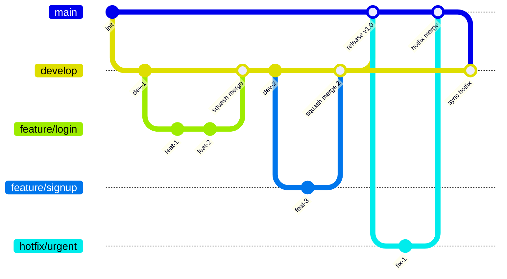

## はじめに

チーム開発において、Git の履歴管理は地味だが重要な問題だ。特に「どの merge 方法を使うか」は、放っておくとメンバーごとにバラバラになりがちで、後から履歴を追うときに苦労する。

本記事では、GitHub Ruleset を使って squash merge を強制する方法と、その運用上の限界について整理する。

## 想定しているブランチ運用

本記事では Git Flow をベースにした以下のブランチ運用を想定している。正式な Git Flow には release ブランチが存在するが、今回は省略している。



- **main**: 本番環境にデプロイされるブランチ
- **develop**: 開発の統合ブランチ
- **feature/\***: 機能開発用ブランチ (develop から分岐し、develop へ squash merge)
- **hotfix/\***: 緊急修正用ブランチ (main から分岐し、main へ merge 後 develop にも反映)

### なぜ GitHub Flow ではないのか

シンプルさでは GitHub Flow (main + feature ブランチのみ) に軍配が上がる。しかし、Vercel などのホスティングサービスでは、ブランチとデプロイ環境が紐づく設定が一般的だ。

- `main` ブランチ → Production 環境
- `develop` ブランチ → Preview / Staging 環境

この構成を取る場合、develop ブランチを経由するフローの方が運用しやすい。Preview 環境で動作確認してから本番に出す、という流れが自然に実現できる。

## GitHub Ruleset とは何か

GitHub Ruleset は、リポジトリに対するルールを一元管理する機能だ。2023年に GA となり、従来の Branch protection rules を置き換える位置づけにある。

### Branch protection rules との違い

Branch protection rules はブランチ単位でルールを設定する。一方、Ruleset は「ルールセット」という単位でポリシーを定義し、それを複数のブランチやタグに適用できる。

主な違い:

| 項目 | Branch protection rules | Ruleset |
|------|------------------------|---------|
| 適用単位 | ブランチごと | ルールセット単位で複数ブランチに適用 |
| 継承 | なし | Organization レベルで定義可能 |
| merge 方法の制限 | なし | Allowed merge methods で制御可能 |
| Bypass 設定 | 管理者は常に bypass 可能 | 明示的に bypass 権限を設定 |

Ruleset が「上位互換」と言われることもあるが、実際には Branch protection rules でしかできない設定もある。完全な移行には注意が必要だ。

### Ruleset が想定している使われ方

Ruleset は「人ではなくルールを信頼する」思想で設計されている。管理者だから何でもできる、ではなく、明示的に bypass 権限を付与されたロールだけが例外を許される。

これはセキュリティ的には正しいが、柔軟性とのトレードオフになる。

## squash merge を強制する設定

### Allowed merge methods の挙動

Ruleset の "Allowed merge methods" では、以下の3つの merge 方法を個別に許可/禁止できる:

- **Merge commit**: 通常の merge (履歴が全て残る)
- **Squash merge**: 複数コミットを1つにまとめて merge
- **Rebase merge**: コミットを rebase して merge

squash merge だけを許可したい場合は、Squash merge のみにチェックを入れる。

### Ruleset だけで squash merge を強制できる理由

Repository Settings にも "Allow squash merging" などのオプションがあるが、これは「許可する」設定であり、強制ではない。

Ruleset の Allowed merge methods は、これを上書きして「この方法しか使えない」状態を作れる。PR の merge ボタンを押したとき、選択肢が squash merge しか表示されなくなる。

## squash merge 強制によって得られるもの

### 履歴が単純になるメリット

squash merge を強制すると、develop や main の履歴が「1PR = 1コミット」になる。

```
* feat: ユーザー認証機能を追加 (#123)
* fix: ログイン時のバリデーションエラーを修正 (#122)
* feat: ダッシュボードページを実装 (#121)
```

この状態だと:

- `git log` が読みやすい
- `git revert` で PR 単位の取り消しが簡単
- `git bisect` で問題のある PR を特定しやすい

### チーム運用上の恩恵

「この PR は squash で」「この PR は merge commit で」という判断がなくなる。merge 方法の選択を間違える事故も起きない。

レビュー時も「最終的に1コミットになる」前提で見られるので、途中のコミットの粒度を気にしすぎなくて済む。

## squash merge 強制の「限界」

### 条件付き例外が一切作れない

Ruleset の Allowed merge methods には条件分岐がない。「develop への merge は squash だが、main への merge は merge commit」といった設定はできない。

また、特定のラベルが付いた PR だけ例外にする、といった柔軟性もない。全か無かの設定になる。

### Merge Queue や Auto-merge との相性

Merge Queue を有効にしている場合、Queue に入った時点で merge 方法が確定する。「やっぱり merge commit にしたい」と思っても、Queue から外して設定を変える必要がある。

Auto-merge も同様で、設定時に merge 方法を指定するが、Ruleset で制限されていると選択肢がない。

## 実運用で詰まるポイント

### 履歴を残したいケースの存在

以下のような場合、squash merge だと情報が失われる:

- **大規模リファクタ**: 段階的な変更の経緯を残したい
- **複数人での共同作業**: 誰がどの部分を担当したか残したい
- **外部ライブラリの更新**: 複数の breaking change 対応を個別に追える状態にしたい

### 「きれいな履歴」が常に正解ではない

squash merge は「何をしたか」は残るが「どうやってそこに至ったか」は消える。後からデバッグするとき、途中経過が見えないと困ることがある。

特に、後任者が「なぜこの実装になったのか」を調べるとき、squash された1コミットのメッセージだけでは情報が足りないことがある。

## 現実的な回避策

### Bypass 権限による直 merge

Ruleset には Bypass 設定があり、特定のロールやチームに対して Ruleset を無視する権限を付与できる。

ただし、これを乱用すると Ruleset の意味がなくなる。「本当に必要なときだけ使う」という運用ルールとセットで考える必要がある。

### 一時的な Ruleset 切り替え

「今回だけ merge commit にしたい」場合、Ruleset を一時的に無効化する方法もある。

しかし、これは危険だ:

- 無効化中に他の人が merge すると、意図せず merge commit になる
- 有効化し忘れるリスクがある
- チームが大きいほど調整コストが上がる

### 例外用ブランチを用意する

長期的に一番マシな選択肢は、例外用のブランチパターンを Ruleset の対象外にすることだ。

例えば `release/*` ブランチは squash merge を強制しない、という設定にしておく。通常の開発フローには影響を与えず、必要なときだけ例外ルートを使える。

## まとめ

- squash merge 強制は「技術的な設定」ではなく「運用上の選択」
- Ruleset は柔軟性より一貫性を取る仕組み
- 何を失って、何を守るのかを理解した上で使うべき

全ての PR を squash merge にすることが正解とは限らない。チームの規模、プロジェクトの性質、メンバーの Git 習熟度を考慮して、どこまで強制するかを決めるのが現実的だ。
