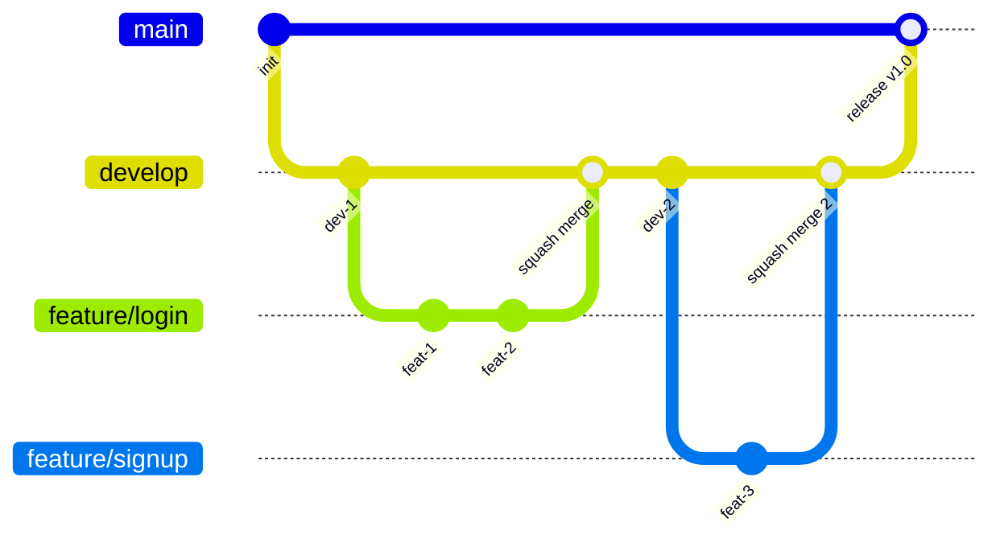

:::message
この記事は、[ジャパゲートシステムズ Advent Calendar 2025](https://qiita.com/advent-calendar/2025/japagate-systems) 20 日目の記事です。
:::

本記事では、GitHub Ruleset を使って squash merge を強制する方法と、その運用上の限界について整理します。

## 想定しているブランチ運用

本記事では Git Flow をベースにした、以下のようなブランチ運用を想定しています。

- **main**: 本番環境にデプロイされるブランチ
- **develop**: 開発の統合ブランチ
- **feature/\***: 機能開発用ブランチ (develop から分岐し、develop へ squash merge)

### なぜこの運用か

当初は GitHub Flow（main + feature ブランチのみ）を想定していましたが、Vercel などでは ブランチとデプロイ環境が前提として結びつくため、`main` を本番、`develop` を開発環境として分けた方が運用が明確になると判断しました。

## なぜ squash merge させたいか（どのような merge 戦略が理想か）

これはあくまで個人の考えですが、変更に追従しやすく履歴の意味を把握しやすいという点から、次のような Git 履歴を残すのが運用面では最も理想だと考えています（超理想）。

- default branch に取り込まれるのは**変更の最小単位**
- 『変更の最小単位で取り込まれてる状態』とは、**いかなる機能を revert したくなった時にもその機能のみを revert できる**こと
  - 適切な粒度でコミットができている
- minimum の単位を revert する際は、単一のコミットのみを指定すれば良い状態になっていること
  - **全コミットハッシュで CI 等が通っている必要**がある

これを merge commit で実現するには 1commit 1commit に極限の集中が求められます。
そのため、**なるべく細かく目的ごとに PR を分け**ながら **default branch に merge するタイミングで squash merge** して誤魔化すことが現実界だと思っています。
（merge のタイミングで少なくとも CI 等が通ってアプリとして完全体になっているとする）

また、develop (default) -> main へのマージにおいては綺麗な履歴をあえて失わせる必要はないため、squash merge ではなく merge commit にした方が良いと考えます。
（branch 運用上 rebase したくなることはないはず）

## GitHub Ruleset で merge 方法を設定する

### GitHub Ruleset とは

[GitHub Ruleset](https://docs.github.com/en/enterprise-cloud@latest/organizations/managing-organization-settings/managing-rulesets-for-repositories-in-your-organization) は、リポジトリに対するルールを一元管理する機能です。
リポジトリ単位での設定の他に、Enterprise や Organization レベルで定義したルールセットを用いて一貫したポリシーを実現できます。

### Allowed merge methods の挙動

Ruleset > Require a pull request before merging > "Allowed merge methods" では、以下の3つの merge 方法のうちどれを許可するかを選択できます。
（各 merge コミットの詳細は省きます）

- **Merge commit**: 通常の merge (履歴が全て残る)
- **Squash merge**: 複数コミットを1つにまとめて merge
- **Rebase merge**: コミットを rebase して merge

### develop ブランチの設定

target branch を develop にして、以下の設定をします。

すると PR 作成時に merge 方法が制限されます。

### main ブランチの設定

一方 main ブランチでは以下のように merge のみを設定しています。

## GitHub Ruleset による squash merge 強制の「限界」

### 条件付き例外が作れない

Ruleset の Allowed merge methods には条件分岐がありません。
厳密には [bypass](https://docs.github.com/ja/repositories/configuring-branches-and-merges-in-your-repository/managing-rulesets/creating-rulesets-for-a-repository#granting-bypass-permissions-for-your-branch-or-tag-ruleset) による例外設定は可能なのですが、以下のような条件の場合のみに merge commit を指定することができません。

- 大きな機能開発時にまとめて merge したい場合に `feature/xx-まとめ` みたいなのを作ってそこに squash merge して貯めていく
- キリのいいタイミングで default branch にマージする

また、『特定のラベルが付いた PR だけ例外にする』といった柔軟性もなく、全か無かの設定になります。

**回避策**

現状では、一時的に ruleset を外すか develop に積極的に merge する方法を取ってますが、以下のように GitHub Actions を使ったらより柔軟に表現できると思ってます。

https://www.m3tech.blog/entry/github-auto-merge

## まとめ

コミットの目的をチーム内で認識を揃えることで、自ずと最適なマージ戦略を選択できるのではないかと思いました。
